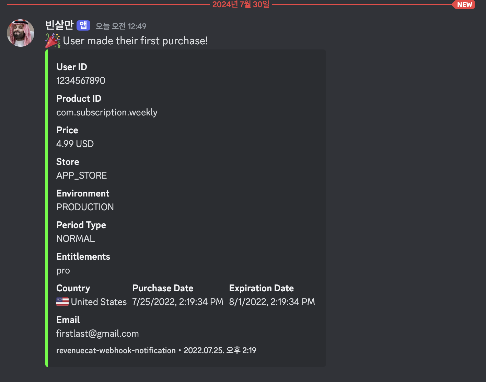

# 🚀 RevenueCat Webhook Notification


[English](./README.md)

이 프로젝트는 RevenueCat 이벤트를 위한 웹훅 핸들러를 제공하며, Discord로 알림을 전송합니다. Firebase Functions를 사용하여 구축되었으며 Firebase 프로젝트에 쉽게 배포할 수 있습니다.

## ✨ 주요 기능


- 🪝 RevenueCat 웹훅 이벤트 처리
- 💬 Discord로 포맷된 알림 전송
- 🌐 다국어 지원
- 🏳️ 알림에 국가 국기와 이름 포함
- 🤖 사용자 정의 가능한 봇 이름 및 아바타

## 📋 사전 요구 사항

- 📦 Node.js 및 npm 설치
- 🔥 Firebase CLI 설치 (`npm install -g firebase-tools`)
- 🏗️ Firebase 프로젝트 설정
- 🔗 Discord 웹훅 URL

## 🛠️ 설치

1. 이 저장소를 복제합니다:
   ```
   git clone https://github.com/your-username/revenuecat-webhook-notification.git
   cd revenuecat-webhook-notification
   ```

2. 의존성을 설치합니다:
   ```
   npm install
   ```

3. `config.example.json`을 `config.json`으로 복사하고 세부 정보를 입력합니다:
   ```
   cp config.example.json config.json
   ```

4. `config.json`을 편집하여 Discord 웹훅 URL, 선호하는 언어 및 기타 설정을 입력합니다.

## ⚙️ 설정

`config.json` 파일은 다음과 같은 내용을 포함해야 합니다:

```json
{
  "discordWebhookUrl": "YOUR_DISCORD_WEBHOOK_URL",
  "slackWebhookUrl": "YOUR_SLACK_WEBHOOK_URL",
  "botName": "RevenueCat Bot",
  "botAvatarUrl": "",
  "language": "ko",
  "timeZone": "Asia/Seoul"
}
```

## 🚀 배포

1. Firebase에 로그인합니다:
   ```
   firebase login
   ```

2. Firebase 프로젝트를 초기화합니다:
   ```
   firebase init functions
   ```

3. 함수를 배포합니다:
   ```
   firebase deploy --only functions
   ```

## 📖 사용 방법

배포가 완료되면 RevenueCat 대시보드에서 웹훅을 설정하고 Firebase 함수 URL을 지정합니다. 이 함수는 RevenueCat 이벤트를 수신하고 지정된 Discord 채널로 포맷된 알림을 전송합니다.

## 🎨 사용자 정의

- 🌐 `localization.json`을 수정하여 언어 번역을 추가하거나 변경할 수 있습니다.
- 🏳️ `countries.json`을 편집하여 국가 정보를 업데이트할 수 있습니다.
- 💬 `index.js`의 `createDiscordMessage` 함수를 조정하여 Discord 메시지의 형식을 변경할 수 있습니다.

## 🤝 기여하기

기여는 언제나 환영합니다! Pull Request를 제출해 주세요.

## 📄 라이선스

이 프로젝트는 MIT 라이선스 하에 있습니다 - 자세한 내용은 [LICENSE](LICENSE) 파일을 참조하세요.

## 🙏 감사의 글

- [RevenueCat](https://www.revenuecat.com/): 구독 및 인앱 구매 인프라 제공
- [Firebase](https://firebase.google.com/): 서버리스 함수 플랫폼 제공
- [Discord](https://discord.com/): 웹훅 통합 기능 제공
- [Slack](https://slack.com): 웹훅 통합 기능 제공
